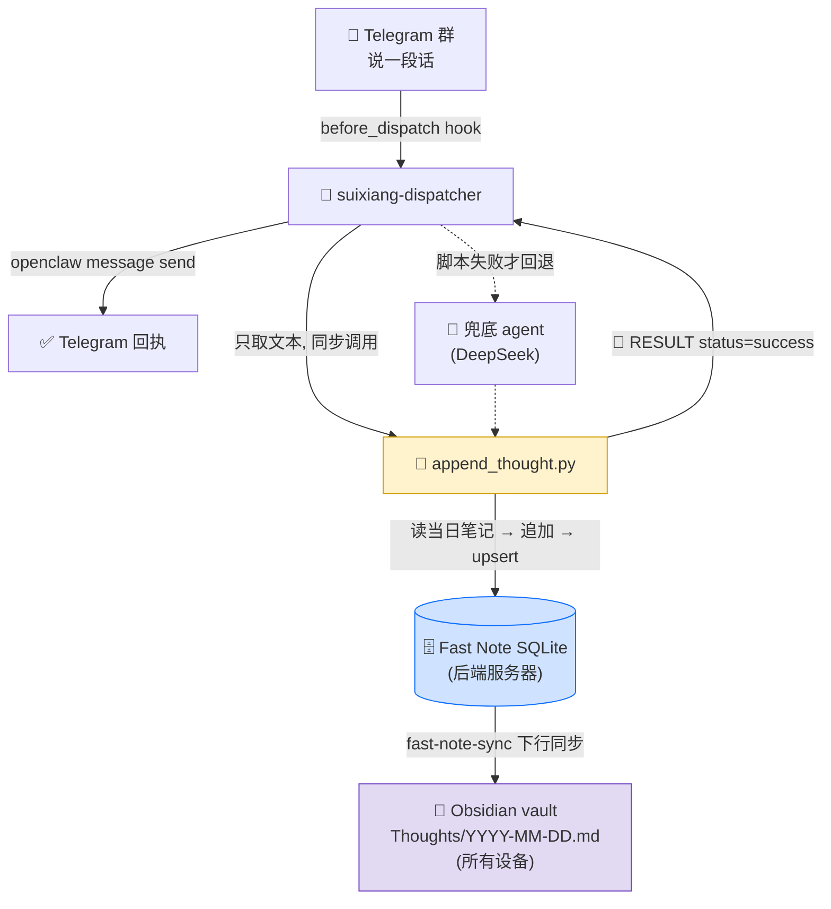

# Thoughts2Obsidian 🧠📝

> 在 Telegram 群里随口说一句，它就忠实地把你的「随想」原样存进 Obsidian 的当日笔记，并同步到所有设备。
>
> Say anything in a Telegram group; it faithfully appends your fleeting **thought** — verbatim — into today's Obsidian note and syncs it to every device.

**Thoughts2Obsidian** 是 [Podcast2Obsidian](https://github.com/Na2H2P2O7/Podcast2Obsidian) 的姊妹项目，共享同一套基础设施（OpenClaw dispatcher + Fast Note 硬写入 + Telegram 回执），但只做一件极简的事：**当你的随身速记本**。

A sibling of [Podcast2Obsidian](https://github.com/Na2H2P2O7/Podcast2Obsidian), built on the same stack (OpenClaw dispatcher + direct Fast Note write + Telegram receipt), but doing one tiny thing: **being your always-on scratchpad.**

---

## ✨ 它做什么 / What it does

你向一个固定的 Telegram 群发消息，每一条都被：

- **原样记录**：只记录，绝不发挥、扩写、评论或回答。逐字保存（语音输入的口语、错别字都照原意保留）。
- **增量追加**：写入当日文件 `Thoughts/YYYY-MM-DD.md`，按时间顺序追加，**绝不覆盖**。
- **打上时间戳**：每条前加 `HH:MM`（时区可配，默认 `America/New_York`）。
- **多设备同步**：硬写入 Fast Note 后端 → 经 [fast-note-sync](https://github.com/) 同步到所有设备的 Obsidian vault。
- **即时回执**：群里立刻收到 `✅ 随想已记录（今日第 N 条）🕐 日期 时间`，离开电脑也知道成没成功。

> 💡 **核心理念**：日常路径是**纯脚本、不碰 LLM**——确定、即时、零幻觉。只有脚本写入失败时，才回退到 LLM agent 兜底。

You message a fixed Telegram group; every message is recorded **verbatim**, **appended** (never overwritten) to a per-day note with an `HH:MM` timestamp, **hard-written** into the Fast Note backend (so it syncs to every device's Obsidian vault), and **acknowledged** instantly in-chat. The daily path is **pure script, no LLM** — deterministic and hallucination-free; an LLM agent only steps in if the script write fails.

---

## 🖼️ 效果 / In action

群里发一句话，几秒后收到回执；笔记里多出一条：

```markdown
# 2026-06-27

**00:04**
我发现了一个找对象的新赛道，许多人都卡穿搭……

**09:18**
开会时突然想到：把 onboarding 拆成三段式。
```

```
你：  开会时突然想到：把 onboarding 拆成三段式。
Bot： ✅ 随想已记录（今日第 2 条）
      🕐 2026-06-27 09:18
```

---

## 🏗️ 架构 / Architecture



为什么硬写 Fast Note 而不是直接写本机 vault：**Fast Note 后端 DB 在服务器上**，各设备的 Obsidian 通过 `fast-note-sync` 插件从它同步下来。写一处 = 所有设备同步。

Why hard-write Fast Note instead of the local vault directly: the Fast Note backend DB lives on a server; every device's Obsidian pulls from it via the `fast-note-sync` plugin. Write once → sync everywhere.

---

## 🧩 兜底机制 / Agent fallback

| 路径 | 触发条件 | 谁来处理 |
|---|---|---|
| **纯脚本**（默认） | 任何文本消息 | `append_thought.py`，确定性写入，毫秒级 |
| **LLM 兜底** | 脚本写入失败 / 异常 | dispatcher 返回「未处理」→ 路由到群绑定的 DeepSeek agent，按 [`agent/AGENTS.md`](agent/AGENTS.md) 补记 |

> ⚠️ 兜底 agent 同样被严格约束：**只记录，不发挥**。

---

## 📁 仓库结构 / Repository layout

```
.
├── SKILL.md                          # skill 说明（OpenClaw skill 定义）
├── deploy.sh                         # 一键部署 + 接线 openclaw.json + 重启 gateway（幂等）
├── scripts/
│   ├── append_thought.py             # 核心：读现有 → 追加 → 硬写 Fast Note → 打印 RESULT
│   └── run_profile.sh                # CLI 包装 + Telegram 回执（手动/兜底用）
├── extensions/suixiang-dispatcher/   # OpenClaw 插件：before_dispatch hook
│   ├── index.js
│   ├── openclaw.plugin.json
│   └── package.json
├── profiles/default/
│   └── config.env.example            # 配置模板（复制为 config.env 填入你的值）
└── agent/
    ├── AGENTS.md                     # 兜底 agent 指令
    └── models.json                   # 兜底 agent 的 agentDir 占位
```

---

## 🔧 依赖 / Dependencies

| 组件 | 说明 |
|---|---|
| [OpenClaw](https://github.com/) | 多 agent 网关，提供 Telegram 通道、`before_dispatch` hook、`message send` |
| [Fast Note](https://github.com/) + `fast-note-sync` | 笔记后端 + Obsidian 同步插件（多设备） |
| Python ≥ 3.9 | `append_thought.py`（仅标准库：`sqlite3` / `zoneinfo` / `fcntl`） |
| Node.js | 运行 OpenClaw 插件（dispatcher） |
| Telegram Bot | 加入你的随想群，作为收发端点 |

> 📝 本项目的 Fast Note 写入逻辑（`upsert_fast_note_markdown` 等）复用自 Podcast2Obsidian，逐行裁剪，避免引入庞大依赖。

---

## 🚀 安装 / Installation

```bash
git clone https://github.com/Na2H2P2O7/Thoughts2Obsidian.git
cd Thoughts2Obsidian

# 1) 配置
cp profiles/default/config.env.example profiles/default/config.env
$EDITOR profiles/default/config.env            # 填入 SUIXIANG_CHAT_ID 等

# 2) 指定目标机（运行 OpenClaw + Fast Note 后端的那台）
export SUIXIANG_SSH_HOST=<你的 ssh 别名>        # 默认 mac2016

# 3) 部署：同步文件 + 接线 openclaw.json（备份后幂等 patch）+ 重启 gateway
./deploy.sh
```

`deploy.sh` 会把文件 rsync 到目标机的 `~/.openclaw/...`，并在 `openclaw.json` 中登记插件、兜底 agent、群绑定（每次先备份）。

---

## ⚙️ 配置 / Configuration

`profiles/default/config.env`（由 `config.env.example` 复制）：

| 字段 | 含义 |
|---|---|
| `SUIXIANG_CHAT_ID` | Telegram 随想群 chat_id（负数） |
| `SUIXIANG_FOLDER` | Obsidian 目标文件夹（默认 `Thoughts`） |
| `SUIXIANG_TZ` | 日期切换 + 时间戳时区（默认 `America/New_York`） |
| `APPEND_SCRIPT` | `append_thought.py` 部署路径（`$HOME` 自动展开） |
| `FAST_NOTE_ENABLE_SQLITE_BACKUP` | 写前对 Fast Note sqlite 一次性备份（`1` 开启） |

dispatcher 的运行配置来自 `openclaw.json` 的 `plugins.entries["suixiang-dispatcher"].config`，由 `deploy.sh` 自动写入（同样支持 `telegramGroupId` / `folder` / `tz` 等）。

---

## 📄 输出格式 / Output format

- 文件夹固定 `Thoughts/`；当日文件 `YYYY-MM-DD.md`。
- 文件首行 `# YYYY-MM-DD`；每条 `**HH:MM**` 加粗时间戳行 + 换行后的原文。
- 同日多条增量追加到末尾，**绝不覆盖**；并发用 `flock` 串行化读-改-写。
- 空 / 非文本消息：静默跳过（不记录、不回执）。

---

## 📌 说明与限制 / Notes & limitations

- 仅记录**纯文本**消息；图片 / 语音等非文本暂不处理。
- 时间戳与跨日切换以配置时区为准（默认美东）。
- 兜底依赖 OpenClaw 的 agent 路由与所配模型（如 DeepSeek）的可用性。
- 这是个人速记工具，按个人使用场景设计。

---

## 🙏 致谢 / Acknowledgements

- [Podcast2Obsidian](https://github.com/Na2H2P2O7/Podcast2Obsidian) — 共享的 dispatcher / Fast Note / 回执机制
- OpenClaw、Fast Note、Obsidian、Telegram

---

## ⚠️ 免责声明 / Disclaimer

- 本项目仅供**个人使用**，用于记录你自己的想法。
- 你需自行保管 Telegram bot token、chat_id 及服务器凭据；请勿提交到公共仓库（已通过 `.gitignore` 与配置模板隔离）。
- 作者不对数据丢失或同步异常承担责任；重要内容请自行备份。

For personal use only. Keep your tokens / chat_id / server credentials private (they are isolated via `.gitignore` and the config template). No warranty; back up anything important.

---

## 📝 License

[MIT](LICENSE) — 代码本身。你记录的随想内容归你所有。
